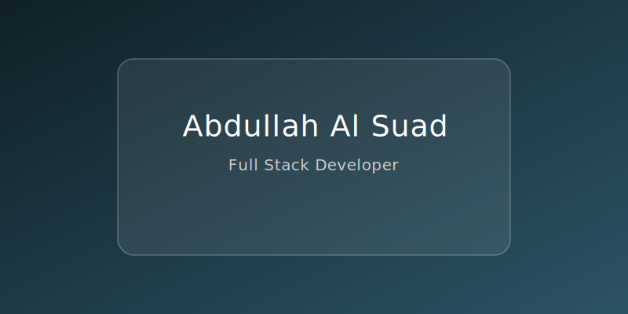

  

<h1 align="center">👋 Hi I'm  Abdullah Al Suad</h1>

### 
Programmer | Web Developer | Front-End Developer 👨‍💻

 

<!-- About -->

<h2>&nbsp; About:</h2>

<!-- About Section -  -->

  👋 Hi! I'm a passionate <b>Front-End Developer</b> from Bangladesh 🇧🇩. 
  I craft interactive and modern web experiences using <b>React.js</b>, <b>HTML</b>, <b>CSS</b>, <b>JavaScript</b>, <b>Next.js</b>, <b>Node.js</b>, and <b>Express</b>.
 
I also enjoy exploring <b>Python</b> 🐍 and <b>C++</b> 💻.
  <b>My mission?</b> Keep learning 📚, push boundaries, and build awesome things 🛠️. 
 
  <b>Let’s connect and create something amazing together!</b> 🚀

<h2>&nbsp; Current Overview:</h2>
 

- 🧣 **Learning Deep Dive into Advanced React & Next.js**
  

- 🔭 **Exploring Figma** for design mockups.
- 💻 **Working on a new e-commerce project.**
- 🤝 **Looking to collaborate on open-source projects.**

 

<!-- GitHub Stats -->

<h2>&nbsp; GitHub Stats:</h2>

 

 
  

 

<!-- Technology  -->

<h2>&nbsp; Tech Stack:</h2>
 

<!-- Programming Languages  -->

  

  

  

 

<!-- Reach me out -->

<h2>&nbsp; Wait for Your Messages!</h2>
 

  

  
  
  
  

